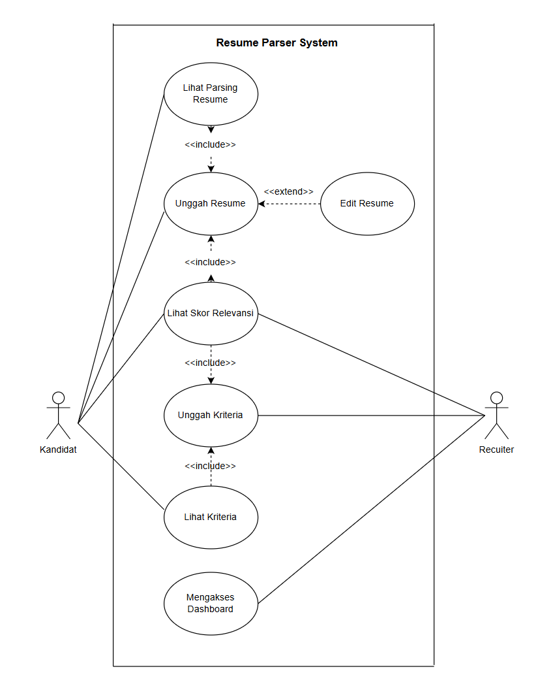
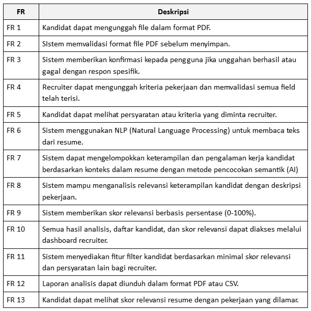
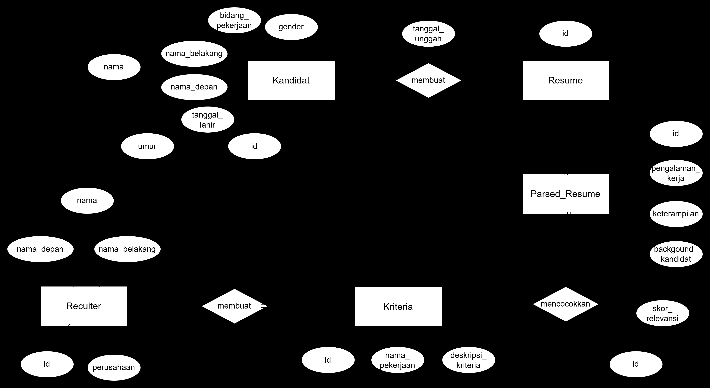
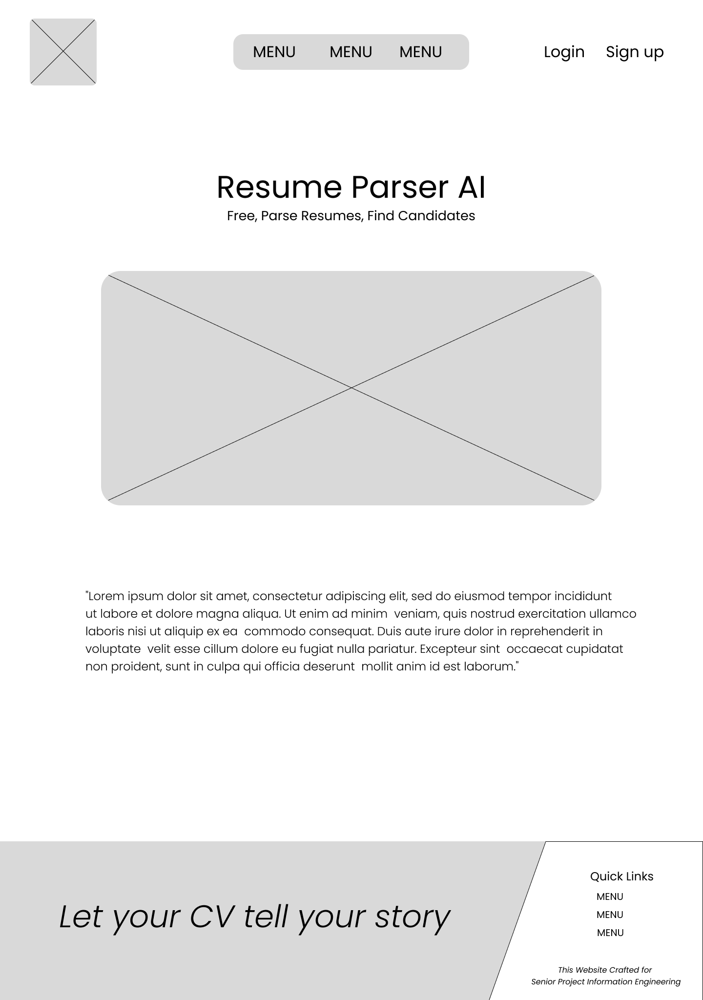
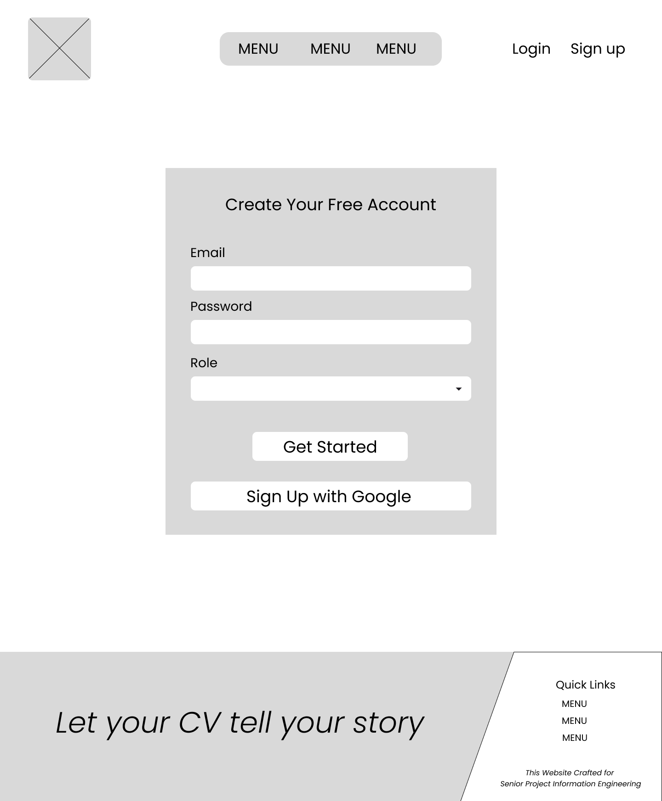
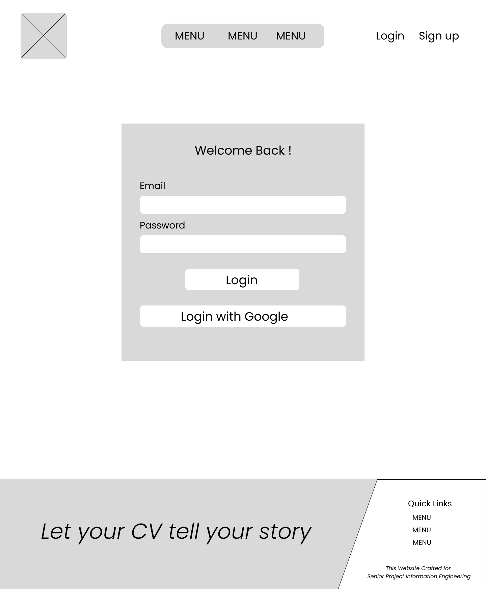
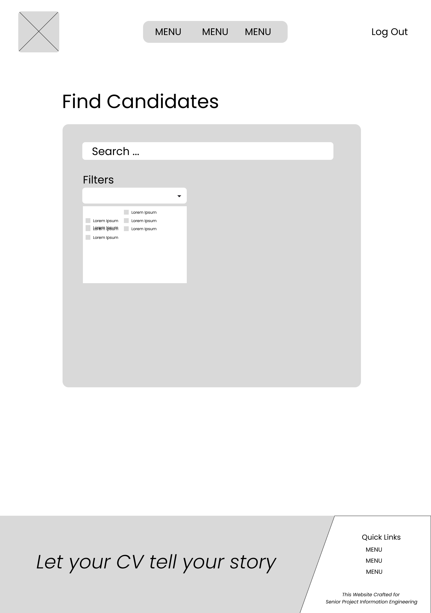
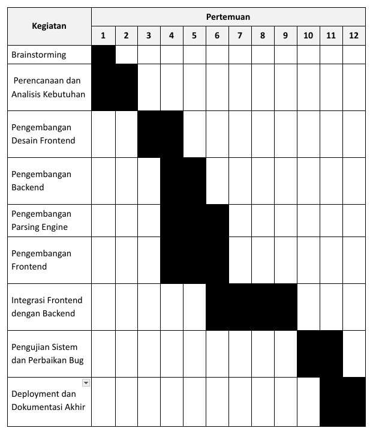

# Nama Kelompok
Info Loker  

## Anggota Kelompok  
- Timotius Kristafael Harjanto - 22/494980/TK/54357
- Raden Aryo Bismo Nugroho - 22/494473/TK/54233
- Fahrin Ulya Nisrina - 22/497798/TK/54557

## Project Senior Project TI  
Departemen Teknologi Elektro dan Teknologi Informasi, Fakultas Teknik, Universitas Gadjah Mada  

## Tentang Proyek  
**Nama Produk**: Resume Parser AI

**Jenis Produk**: Web App

**Latar Belakang**:  
Proses rekrutmen pekerjaan seringkali diawali dengan proses peninjauan resume kandidat. Dalam proses ini, recuiters melakukan pekerjaan yang repetitif karena harus meninjau ratusan hingga ribuan resume dan menghabiskan banyak waktu untuk menemukan kandidat untuk suatu posisi pekerjaan. Beberapa perusahaan telah mengotomatisasi proses tersebut dengan metode pencocokan keyword. Namun, metode ini kurang memahami konteks dari keyword yang digunakan dalam resume karena hanya mencocokkan keyword tanpa menganalisis keterampilan atau pengalaman kandidat. Oleh karena itu, recuiters membutuhkan sistem yang dapat menyaring kandidat berdasarkan relevansi atau kesesuaian deskripsi pekerjaan dari recuiters dengan mengelompokkan keterampilan dan pengalaman kandidat berdasarkan kesamaan konteks.

**Permasalahan**:  
Bagaimana cara mengembangkan sistem resume parser berbasis AI yang dapat memahami konteks keterampilan dan pengalaman kandidat serta dapat diakses semua orang?

**Ide Solusi**:  
- AI berbasis NLP untuk parsing dan analisis resume.
- Sistem berbasis cloud untuk pemrosesan resume secara cepat dan scalable.
- Matching engine untuk mencocokkan kandidat dengan lowongan pekerjaan.
- Dashboard berbasis web bagi perekrut untuk mengelola dan menilai kandidat.

**Analisis Kompetitor**:  
Resume Parser AI bersaing dengan beberapa platform rekrutmen berbasis AI seperti Resume.io, Parseur, dan HireEZ. Resume.io unggul dalam pembuatan resume ATS-friendly namun kurang dalam fitur parsing otomatis untuk HR. Parseur menawarkan parsing CV otomatis dengan integrasi API yang kuat, tetapi tidak menyediakan fitur filtering kandidat secara langsung. Sementara itu, HireEZ menggunakan AI untuk mencari, menganalisis, dan merekomendasikan kandidat, tetapi lebih cocok untuk perusahaan besar dengan biaya yang tidak terjangkau bagi individu atau startup. Keunggulan utama Resume Parser AI adalah kombinasi parsing AI dengan filtering otomatis berbasis konteks keterampilan dan pengalaman, menjadikannya solusi yang lebih komprehensif dan efisien bagi HR di berbagai skala bisnis.

## Metodologi SDLC  
**Metodologi SDLC**:
Agile dengan pendekatan Scrum

**Alasan Pemilihan Metodologi**:
- Agile memungkinkan pengembangan perangkat lunak secara iteratif, sehingga tim dapat beradaptasi dengan perubahan kebutuhan pengguna.
- Dengan pertemuan rutin seperti sprint planning dan daily stand-up meetings, koordinasi antar anggota tim lebih efektif.
- Pengujian dilakukan secara berulang pada setiap iterasi, mengurangi kemungkinan kesalahan besar di akhir proyek.

## Perancangan Tahap 1-3 SDLC
**Tujuan dari Produk**:
Resume Parser AI bertujuan untuk mengekstrak informasi penting dari dokumen CV/resume secara otomatis dan mengubahnya menjadi format terstruktur untuk mempermudah proses rekrutmen.

**Pengguna potensial**:
- Perusahaan Rekrutmen
  Mempermudah penyaringan kandidat secara otomatis berdasarkan informasi yang relevan.
- HR dari Perusahaan
  Menghemat waktu dalam memilah kandidat yang sesuai dengan kebutuhan perusahaan.
- Pelamar Kerja
  Memastikan CV mereka diinterpretasikan dengan baik oleh sistem.

**Use Case Diagram**:

**Functional Requirements**:

**Entity Relationship Diagram**:

**Low-Fidelity Wireframe**:

Landing - Desktop

Sign Up - Desktop

Login - Desktop

Dashboard HRD - Desktop

Dashboard Job Seeker - Desktop

**Gantt-Chart**:

